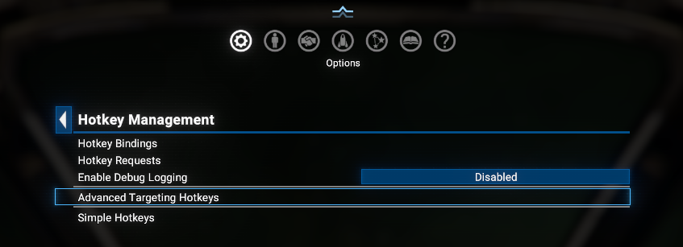
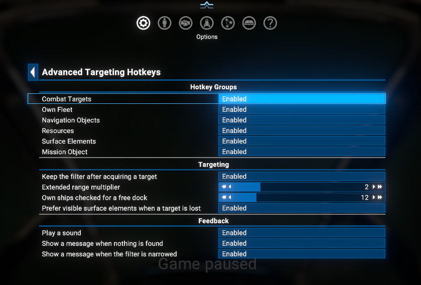

# Advanced Targeting Hotkeys

Filtered target acquisition for X4: Foundations, built on top of the [Native Hotkey API](https://www.nexusmods.com/x4foundations/mods/2181) - every action below is bindable through the native game keybinding UI, just like a vanilla control.

## Overview

Vanilla `Next Target` / `Previous Target` cycle through everything around you. Next to a station that means pressing the key past a dozen storage modules to get back to the fighter shooting at you.

This mod adds a **sticky filter**. Each acquisition hotkey targets the nearest matching object *and* remembers what you asked for, so Next/Previous then walk only that category: enemies, stations, or the turrets of the ship you're attacking.

The filter is dropped the moment the target changes any other way - a mouse click, a vanilla targeting key, or the target leaving the sector - and Next/Previous go back to cycling everything, exactly like vanilla.

**Narrow Filter to Selected Type** pins the filter one step further, to the exact type of the current target: one turret model on a destroyer, or one ship type out of a mixed enemy wing.

### Auto-switch when target is lost

Losing a target is the one case where the filter isn't dropped. For enemies, incoming missiles, collectables and surface elements, the next one is selected automatically - "next" being the entry that followed the one you lost, not just the closest one:

- A collected container counts as lost, so chain-collecting drops works too.
- A ship that stops being hostile counts as lost - shoot the pilot out and you move on instead of staying locked onto an empty hull.
- For surface elements the handover prefers one you have line of sight to, skipping those hidden behind the hull. The check is the game's own ray cast, the same one weapon aiming uses. Can be switched off in the settings.
- When the last element of a kind is gone you get **the hull itself**, never a different kind of element, and any type narrowing is cleared with it.
- If the category is empty, nothing happens at all - no sound, no message, target left alone.

Navigation categories - own ships, stations, gates, asteroids, mission targets - deliberately don't do this.

## Requirements

- **X4: Foundations**: Version **8.00** or higher.
- **Native Hotkey API** by Chem O`Dun, version **8.00.07** or higher. It also hosts this mod's settings page and its debug switch:
  - Available on Nexus Mods: [Native Hotkey API](https://www.nexusmods.com/x4foundations/mods/2181)
  - Available on Steam Workshop: [Native Hotkey API](https://steamcommunity.com/sharedfiles/filedetails/?id=3750545906)
- **Print Extension List** by Chem O`Dun, version **1.01** or higher. Writes the game version and enabled extensions to the debug log at startup, so any log sent with a bug report identifies the setup:
  - Available on Nexus Mods: [Print Extension List](https://www.nexusmods.com/x4foundations/mods/2191)
  - Available on Steam Workshop: [Print Extension List](https://steamcommunity.com/sharedfiles/filedetails/?id=3770927339)
- Indirectly depends on **UI Extensions and HUD** by [kuertee](https://next.nexusmods.com/profile/kuertee?gameId=2659), which is a dependency of the *Native Hotkey API*:
  - Available on Nexus Mods: [UI Extensions and HUD](https://www.nexusmods.com/x4foundations/mods/552)

## Installation

- **Steam Workshop**: [Advanced Targeting Hotkeys](https://steamcommunity.com/sharedfiles/filedetails/?id=3775194109) - only for **Game version 9.00** with latest Steam version of the `UI Extensions and HUD` mod (indirectly).
- **Nexus Mods**: [Advanced Targeting Hotkeys](https://www.nexusmods.com/x4foundations/mods/2278)

## Hotkeys

All 20 actions fire only while you're piloting a ship with no menu open. None come bound to a key - assign the ones you want under **Options > Hotkey Management > Hotkey Bindings**.

### Acquisition

Each of these targets the nearest match and switches the filter to that category.

- **Target Nearest Enemy** - nearest hostile ship, drone, mine, missile or explosive.
- **Target Nearest Enemy (XS-M)** - nearest hostile fighter-class or medium ship.
- **Target Nearest Enemy (L-XL)** - nearest hostile capital ship.
- **Target Nearest Incoming Missile** - nearest missile actually aimed at you, so you can shoot it down.
- **Target Nearest Own Ship** - nearest ship you own, excluding the one you're flying.
- **Target Nearest Own Ship for Landing** - nearest own ship with a docking bay that fits your current hull.
- **Target Nearest Station** - nearest known station.
- **Target Nearest Gate** - nearest known gate, accelerator or highway entry.
- **Target Nearest Collectable** - nearest known dropped ware or lockbox.
- **Target Nearest Asteroid** - nearest known asteroid, for manual mining.
- **Target Surface Element on Selected Object** - nearest working surface element of the ship or station you have selected.
- **Target Engine on Selected Object** - same, restricted to engines.
- **Target Turret on Selected Object** - same, restricted to turrets and launchers.
- **Target Shield Generator on Selected Object** - same, restricted to shield generators.
- **Target Active Mission Object** - the object your current mission points at.

The four surface-element hotkeys work on the object **you have selected** and on nothing else: select a carrier across the sector and you get that carrier's turrets, not those of the fighter next to you. With a surface element already selected they stay on the same hull, and so does Next/Previous. With nothing selected they fall back to the last hull you worked on; with no previous hull they do nothing and say so. Docked ships are never included, so cycling a carrier's turrets won't wander into its bays.

### Navigation

- **Select Next Target (Filtered)** - next object in the active filter, by distance, wrapping around.
- **Select Previous Target (Filtered)** - previous object. With nothing selected, starts from the farthest one.
- **Deselect Target and Reset Filter** - clears the target **and** the filter.
- **Target Along Line of Sight** - picks whatever you're looking at.
- **Narrow Filter to Selected Type** - pins the active filter to the type of the selected object.

**Narrow Filter to Selected Type** needs a target one of this mod's hotkeys put there. It's set-only, not a toggle - pressing it again changes nothing, since everything you can cycle to is already of that type. It goes away exactly when the filter does.

**Target Along Line of Sight** starts from a one-degree cone dead ahead and widens in steps to 25 degrees, stopping at the first hit, so what's under your crosshair wins over what's merely in front of you. Surface elements are searched at each step, with a range limit that tightens as the cone widens, so a wide sweep can't snap you onto a turret on a distant station.

Range follows the radar: ordinary objects have to be inside your ship's radar range, while capital ships, stations and gates stay pickable further out.

### When nothing matches

A hotkey never substitutes a different kind of object for the one you asked for. Press **Target Nearest Station** with no station in range and your target is left as it was, with a fail sound and a message naming the empty category. Next/Previous behave the same way when the filter has nothing left in it.

The one exception is the surface-element filters: when a hull has none of the requested kind left, you get **that hull** - by key press, or automatically when the last one is destroyed.

## Relationship to the vanilla targeting hotkeys

X4's own **Target Management** group under **Options > Controls** does a simpler version of some of this, and its entries ignore the filter completely. Running both on different keys is confusing, so the recommendation is to bind this mod's versions and clear the vanilla ones:

- **Target Closest Hostile** -> **Target Nearest Enemy** - also sets the filter, and also finds mines and explosives.
- **Target Object** -> **Target Along Line of Sight** - widening cone from dead centre instead of simply the closest object.
- **Next Target** / **Previous Target** -> **Select Next / Previous Target** - cycles the filter, not everything.
- **Deselect Target** -> **Deselect Target and Reset Filter** - also clears the filter.

Two vanilla controls are left alone on purpose: **Toggle Target Lock** isn't duplicated here at all, and **Next / Previous Surface Element** stay useful - they have no type filter, which is the gap the engine/turret/shield hotkeys fill.

## Settings

Everything is configurable under **Options > Hotkey Management > Advanced Targeting Hotkeys**, on the same page you bind the keys on rather than under a separate Extensions entry.

**Hotkey Groups** - which families of hotkeys get registered at all. All enabled by default:

- **Combat Targets** - the four enemy/missile hotkeys.
- **Own Fleet** - the two own-ship hotkeys.
- **Navigation Objects** - the station and gate hotkeys.
- **Resources** - the collectable and asteroid hotkeys.
- **Surface Elements** - the four surface-element hotkeys.
- **Mission Object** - the mission-object hotkey.

**Targeting**:

- **Keep the filter after acquiring a target** (on) - turn off to make Next/Previous always cycle everything, vanilla-style.
- **Extended range multiplier** (`2`) - how far beyond radar range large and already-known objects stay pickable.
- **Own ships checked for a free dock** (`12`) - caps the docking-bay scan behind *Target Nearest Own Ship for Landing*.
- **Prefer visible surface elements when a target is lost** (on) - hand over to an element you have line of sight to rather than one hidden behind the hull.

**Feedback**:

- **Play a sound** (on) - confirmation blip on success, fail blip when nothing matched.
- **Show a message when nothing is found** (on) - names the empty category.
- **Show a message when the filter is narrowed** (on) - names the type the filter was pinned to.

Turning a group off means those hotkeys are never registered, so they don't occupy one of the Native Hotkey API's 48 shared slots. Turning a group **on** takes effect immediately; turning one **off** only frees the slots on the next reload, since the API's registry has no unregister path. To free a single hotkey's slot right away, disable it on the API's **Hotkey Requests** page instead.

Settings are stored per profile, alongside your key bindings, so they follow you across saves the same way the bindings do.

### Debug logging

This mod has no debug switch of its own - it follows the *Native Hotkey API*'s **Debug Logging** setting, one level up on the **Options > Hotkey Management** page. Switching that on covers the API and every mod built on it.

You then get one line per key press (which hotkey, which filter, what got targeted or why nothing did) plus the detail behind it. Lines are prefixed `AdvancedTargetingHotkeys:` and use the `general` filter, so start the game with `-debug general -logfile debuglog.txt` to capture them.

## Limitations

- Pilot mode only. There are no map-mode or on-foot variants.
- Candidate lists are rebuilt on every key press, so they always match the current situation. On a station with hundreds of surface elements that's measurable work per press.
- The *Native Hotkey API*'s 48-slot pool is shared with every mod using it. This one asks for 20 with everything enabled.

## Videos

- [Simple demonstration of features](https://www.youtube.com/watch?v=VDMxgQFWeB4)

## Credits

- **Author**: Chem O`Dun, on [Nexus Mods](https://next.nexusmods.com/profile/ChemODun/mods?gameId=2659) and [Steam Workshop](https://steamcommunity.com/id/chemodun/myworkshopfiles/?appid=392160)
- *"X4: Foundations"* is a trademark of [Egosoft](https://www.egosoft.com).

## Acknowledgements

- [EGOSOFT](https://www.egosoft.com) - for the X series.
- **Trajan von Olb** - whose *More Hotkeys: Advanced Targeting* is where the sticky-filter idea comes from. This is an independent implementation of that concept on a different foundation, sharing no code with it.
- [kuertee](https://next.nexusmods.com/profile/kuertee?gameId=2659) - for the `UI Extensions and HUD` that the *Native Hotkey API* (and therefore this mod) relies on.

## Changelog

### [1.01] - 2026-08-??

- **Fixed**
  - The "no matching target" notifications never appeared - the message text was assembled in a way the script parser rejected.

### [1.00] - 2026-07-31

- **Added**
  - Initial version: 20 pilot-mode targeting hotkeys with a sticky category filter, type-filtered surface-element targeting, automatic hand-over when the target is lost, and a widening-cone line-of-sight pick.
